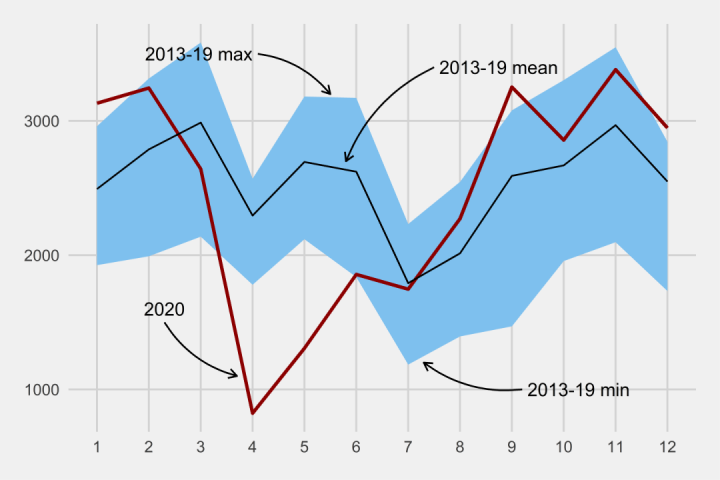
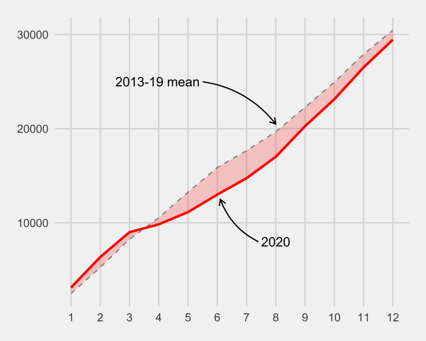
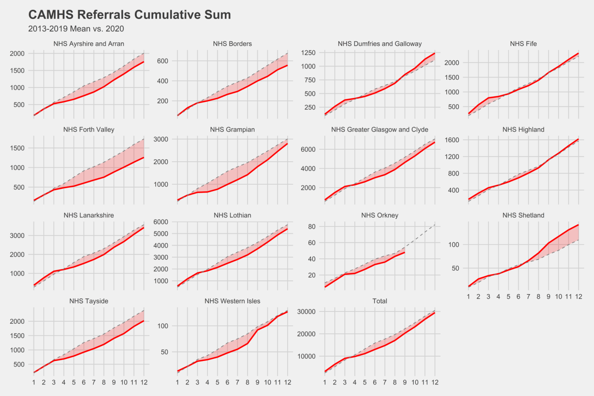
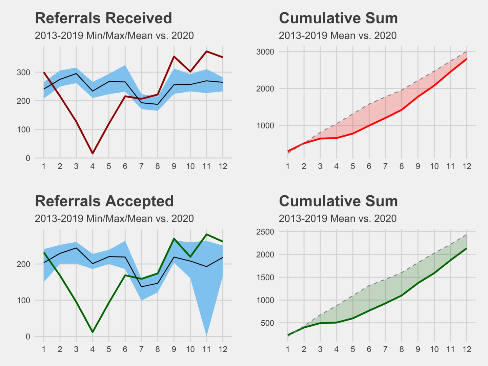
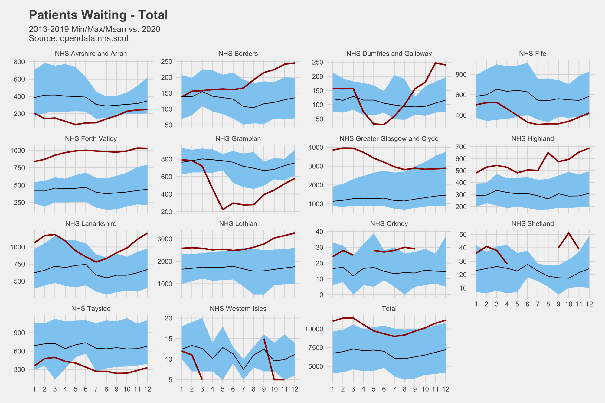
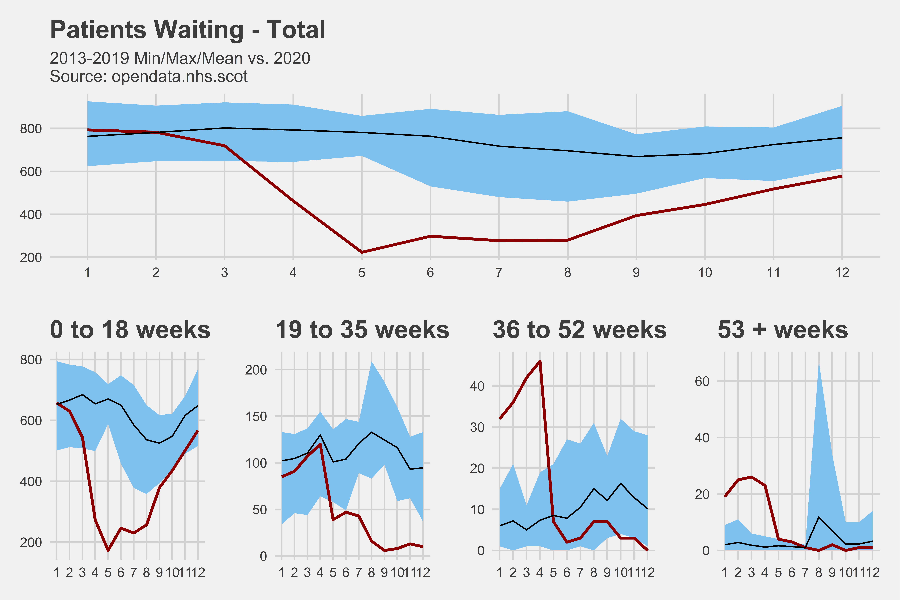
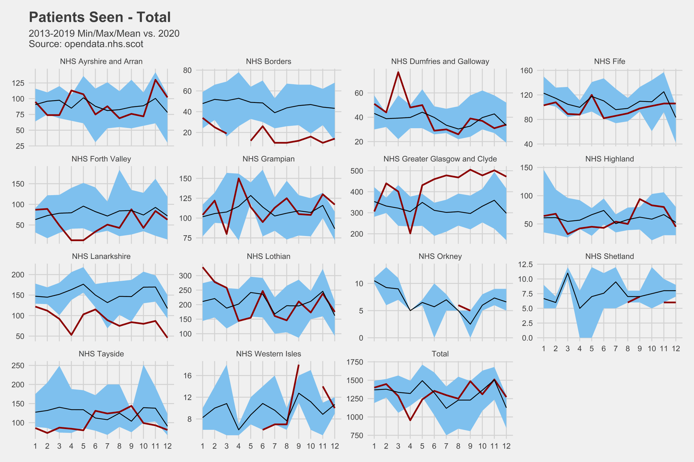
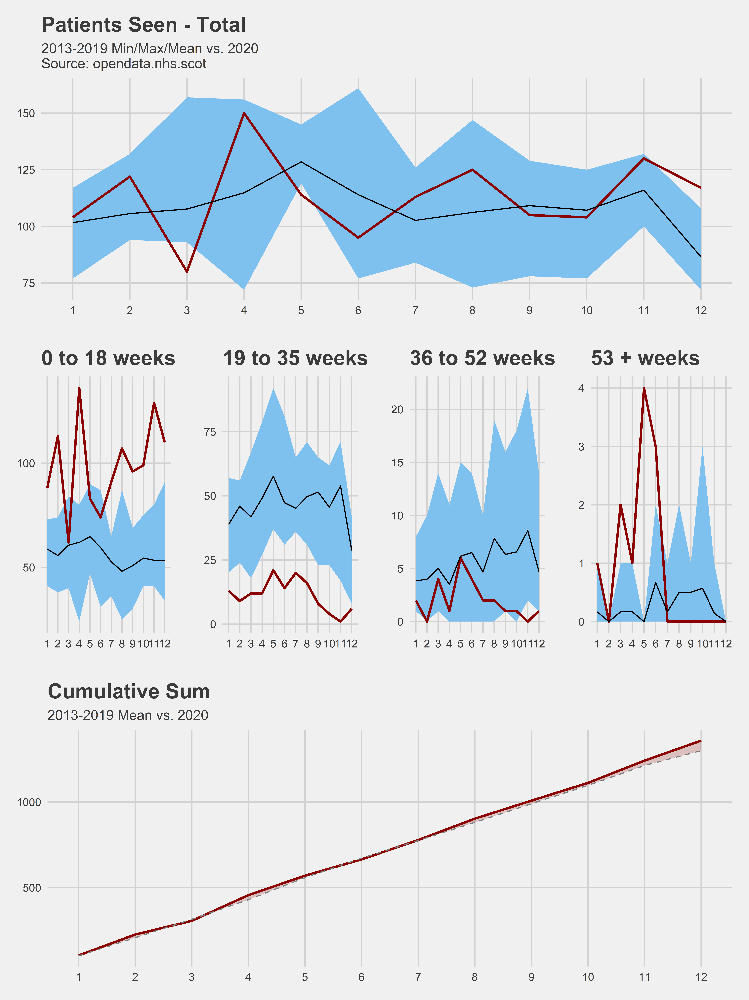
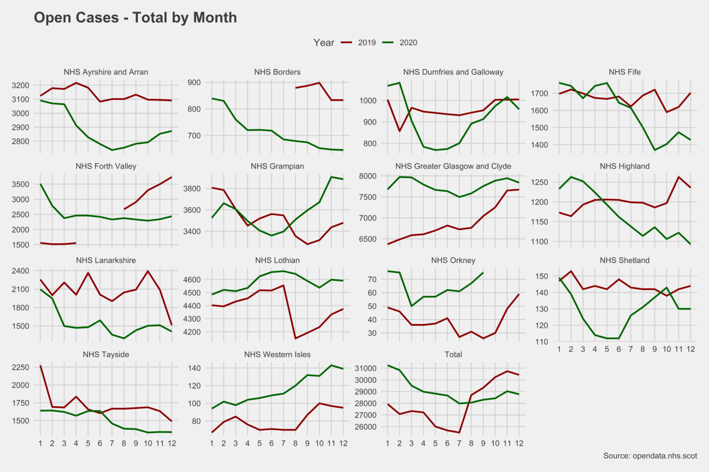

```{r setup, include=FALSE}
knitr::opts_chunk$set(echo = TRUE)
```

# **CAMHS Open Data**

## **Introduction**
Child and Adolescent Mental Health Services (CAMHS) is the name for a range of NHS services which aim to help young people who experience serious emotional, behavioural or mental health difficulties.

The services are delivered by a range of healthcare professionals including psychiatric nurses, child and adolescent psychiatrists, clinical psychologists, social workers, psychotherapists (including child/analytical, systemic/family, cognitive behavioural), creative therapists (including art, music and drama), play therapists, liaison teachers, speech and language therapists, occupational therapists and dietitians.

Publicly available information related to CAMHS referrals and waiting lists is available from the Publich Health Scotland [Open Data Portal](https://www.opendata.nhs.scot/dataset/child-and-adolescent-mental-health-waiting-times). This website presents plots which illustrate trends in CAMHS referrals, waiting lists and numbers of open cases. These are mostly shown comparing 2020 and pre-pandemic trends. It shows figures for Scotland, by Health Board with an additional highlight on NHS Grampian.

## **How to Read the Plots**

### **Example 1 - Referral Counts**



This plot shows the total number of referrals to CAMHS in Scotland for each month of the year. It compares the monthly totals for 2020 as well as the monthly minimum, maximum and average (mean) from pre-pandemic years covering 2013-19.

This way we can put patterns of referral in 2020 into context of what would previously be considered 'normal'. When the red is line is above the black, it's above average for that month. When it is above the blue, it's higher than previously recorded for that month. Where the red line is below the blue, it's lower than ever recorded.

Month number is shown along the bottom (x axis) and a count of referrals appears along the side (y axis). Where plots show data for multiple Health Boards, please note that the y axis will not always be set to the same scale 

### **Example 2 - Cumulative Sum**



This plot shows the cumulative sum of referrals to CAMHS in Scotland over the course of the year. It compares the running total of referrals for the year 2020 compared with the average monthly number of referrals for 2013-19.

The red line is the running total of referrals for 2020. The dashed line represents the historic mean. The shaded area over or under the dashed line represents how far above or below the historical average the number of referrals was.

Again, month number is shown along the x axis and the total number of referrals appears along the y axis.

# **1. Referrals**

## **Monthly Totals**
Referrals to CAMHS by month and health board. The red line is for the year 2020. Blue shows the historic min and max. The black line is historic mean.


## **Cumulative Referrals**
This displays the cumulative sum of referrals by month. The red line is for 2020. The dotted line is the historic mean. The red shaded area represents anything below or above the historic mean.



## **NHS Grampian**
This displays the monthly totals and cumulative sums of CAMHS referrals and accepted referrals for NHS Grampian.




# **2. Patients Waiting**

## **Monthly Totals**
This displays the monthly totals of patients waiting for treatment. The red line is for 2020. Blue shows the historic min and max. The black line is the historic mean.



## **NHS Grampian**
This displays the monthly totals of patients waiting for NHS Grampian, as well as a breakdown of numbers waiting for a range of time periods.



# **3. Patients Seen**

## **Monthly Totals**
This displays the monthly total of patients seen at first appointment by health board. Red line is 2020. Blue is historic min/max. Black line is historic mean. Some boards have missing data for 2020.



## **Cumulative Total**
This displays the cumulative sum of patients seen at first appointment by health board. The red line represents the cumulative total. The dotted line is the cumulative sum of the historic mean. The red shaded area represents anything above or below the cumulative sum of the monthly historic mean.


## **NHS Grampian**
This displays the monthly totals of patients seen at first appointment in NHS Grampian, as well as a breakdown of patients seen after various wait lengths.



# **4. Open Cases**

## **National Open Case**
This displays monthly totals of patients receiving treatment who have not yet been discharged. **Note:** This data only goes back to 2019.



## **NHS Grampian**


# **Data and Links**

## Source

All data used to create these plots was sourced from the Public Health Scotland [Open Data portal](https://www.opendata.nhs.scot/dataset/child-and-adolescent-mental-health-waiting-times) and is used under the [UK Open Government License (OGL)](http://reference.data.gov.uk/id/open-government-licence).

## Websites

You can see how I created this website on my github page [here](http://www.github.com/will-ball/CAMHS)

Find out more about the [Networked Data Lab](https://www.health.org.uk/funding-and-partnerships/the-networked-data-lab) from The Health Foundation

Find out more about the Aberdeen Centre for Health Data Science arm of the project [here](https://www.abdn.ac.uk/achds/research/networked-data-lab-249.php)